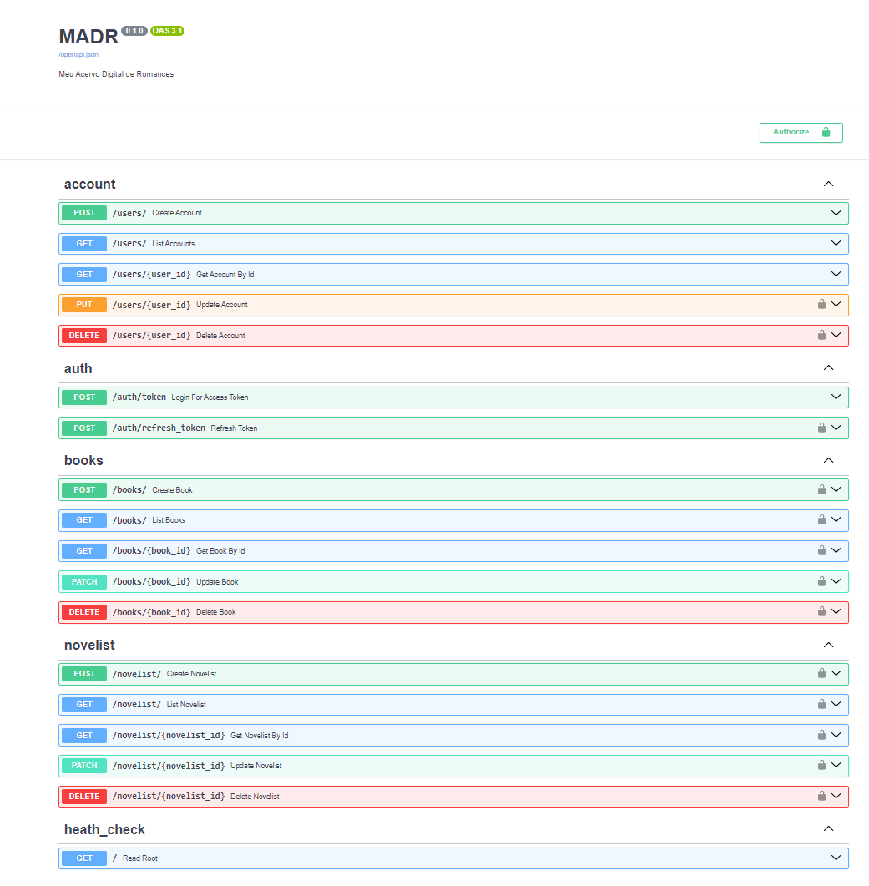

<h1 align="center" style="font-weight: bold;">MADR API 💻</h1>

<div align="center">


</div>

<p align="center">
 <a href="#stack">Tecnologias Utilizadas</a> •
 <a href="#started">Como começar </a> •
 <a href="#routes">Endpoints da API</a> •
</p>

MADR é o desafio de conclusão do curso [FastAPI do Zero](https://github.com/dunossauro/fastapi-do-zero) do [dunossauro](https://github.com/dunossauro/)

O Desafio consiste em criar Api para uma versão simplificado de um acervo digital de livros com python e com framework FastAPI

<h2 id="stack">Tecnologias Utilizadas</h2>

- Python
- PostgreSQL
- Docker
- FastAPI
- SQLAlchemy
- Alembic
- Pytest

<h2 id="started"> Como começar </h2>

Clone o projeto, crie suas variáveis de ambientes (tem o exemplo no arquivo .env-example) depois renome o arquivo para .env

<h3> Para roda o projeto:</h3>

Primeiramente faça o build da aplicação no Docker
```bash
  docker compose build
```
Agora faça o comando para iniciar a api e criar o banco de dados
(com esse commando vc pode ver os logs no seu terminal)
```bash
  docker compose up
```
se usar o docker desktop para ver o logs pode usar o comando abaixo:
```bash
  docker compose up -d
```

<h2 id="routes">Endpoints da API</h2>


